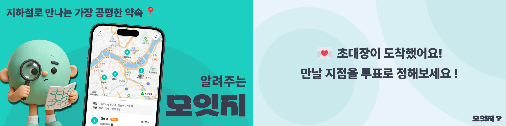
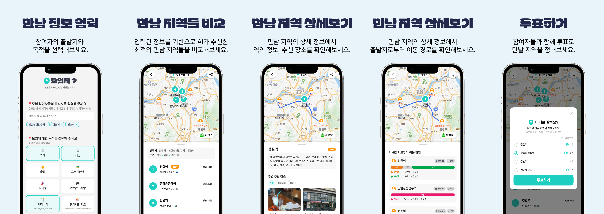

# 🪐 woowacourse-archive

우아한테크코스 7기 프론트엔드 과정을 진행하면서 학습한 내용을 기록합니다.

> 🌕우아한테크코스란🌕
>
> 우아한테크코스는 1년차 주니어 소프트웨어 개발자 수준의 역량을 갖춘 인재 양성을 목표로 하는 우아한형제들 소속 집중 교육 프로그램입니다.

 

## 📚 목차

### 🏃 Mission & Project

- [🥔 프리코스 - 몰입의 시작](#-프리코스)
- [1️⃣ 레벨 1 - 바닐라 자바스크립트](#1️⃣-레벨-1)
- [2️⃣ 레벨 2 - 리액트](#2️⃣-레벨-2)
- [3️⃣ 레벨 3 - 팀 프로젝트 "모잇지(Moitz)"](#3️⃣-레벨-3)
- [4️⃣ 레벨 4 - 성능 최적화와 아키텍처](#4️⃣-레벨-4)

### 🗣️ Activity & Study

- [🎤 테코톡 - 지식 공유](#-테코톡)
- [👥 스터디](#-스터디)

### ✍️ Writing

- [📖 글쓰기 미션 - 회고와 성장](#-글쓰기-미션)
- [💻 테크니컬 라이팅 - 기술적 경험 공유](#-테크니컬-라이팅)

 

## 🥔 프리코스

> 4주간의 몰입 경험. 자바스크립트의 기본 문법을 익히고, 요구사항을 분석하여 구현하는 능력을 키웁니다.

| Mission       | Repository                                                                                        | Pull Request                                                                    |
| ------------- | ------------------------------------------------------------------------------------------------- | ------------------------------------------------------------------------------- |
| 문자열 계산기 | [javascript-calculator-7](https://github.com/eunsoA/javascript-calculator-7)                      | [PR](https://github.com/woowacourse-precourse/javascript-calculator-7/pull/449) |
| 자동차 경주   | [javascript-racingcar-7](https://github.com/eunsoA/javascript-racingcar-7)                        | [PR](https://github.com/woowacourse-precourse/javascript-racingcar-7/pull/348)  |
| 로또          | [javascript-lotto-7](https://github.com/eunsoA/javascript-lotto-7)                                | [PR](https://github.com/woowacourse-precourse/javascript-lotto-7/pull/333)      |
| 편의점        | [javascript-convenience-store-7](https://github.com/eunsoA/javascript-convenience-store-7-eunsoA) | -                                                                               |

 

## 1️⃣ 레벨 1

### 🎯 목표: 자바스크립트와 웹 표준

> Vanilla JS로 작은 규모의 애플리케이션을 만들며 언어의 핵심을 깊이 있게 학습합니다.

- 유지보수하기 좋은 코드와 가독성에 대한 고민
- 테스트 코드(Unit, E2E) 작성과 리팩터링의 생활화
- 웹 표준을 준수하는 UI 구현 및 UX에 대한 고민

| Mission     | Repository                                                                   | Step 1                                                                    | Step 2                                                                    | Note                           |
| :---------- | :--------------------------------------------------------------------------- | :------------------------------------------------------------------------ | :------------------------------------------------------------------------ | :----------------------------- |
| 자동차 경주 | [javascript-racingcar](https://github.com/eunsoA/javascript-racingcar)       | [PR-359](https://github.com/woowacourse/javascript-racingcar/pull/359)    | [PR-415](https://github.com/woowacourse/javascript-racingcar/pull/415)    | TDD, 도메인 로직 분리          |
| 로또        | [javascript-lotto](https://github.com/eunsoA/javascript-lotto)               | [PR-370](https://github.com/woowacourse/javascript-lotto/pull/370)        | [PR-409](https://github.com/woowacourse/javascript-lotto/pull/409)        | DOM 조작, 이벤트 핸들링        |
| 점심뭐먹지  | [javascript-lunch](https://github.com/eunsoA/javascript-lunch)               | [PR-209](https://github.com/woowacourse/javascript-lunch/pull/209)        | [PR-239](https://github.com/woowacourse/javascript-lunch/pull/239)        | Cypress E2E 테스트             |
| 영화 리뷰   | [javascript-movie-review](https://github.com/eunsoA/javascript-movie-review) | [PR-211](https://github.com/woowacourse/javascript-movie-review/pull/211) | [PR-224](https://github.com/woowacourse/javascript-movie-review/pull/224) | 비동기 통신(API), 페이지네이션 |

 

## 2️⃣ 레벨 2

### 🎯 목표 : React 정복과 기술적 두려움 극복

> 리액트라는 거대한 생태계에 압도되기보다, 내 문제부터 해결할 수 있는 작은 고민을 해결하며 더 큰 시야를 가집니다.

- **React & TypeScript**: 레벨 1보다 복잡한 규모의 애플리케이션을 구현하며 기술에 대한 두려움을 없앱니다.
- **Storybook & Testing**: 컴포넌트 단위의 피드백을 위한 시각적 테스트 도구 사용법을 익힙니다.
- **Maintainability**: 유지보수하기 좋은 코드를 고민하고 적용하며, 지속 가능한 개발을 경험합니다.
- **UX & Web Standard**: 주어진 디자인을 웹 표준에 맞게 구현하고, 사용자 경험(UX)을 고려합니다.

| Mission     | Repository                                                                        | Step 1                                                                | Step 2                                                                | Note                                                                                                                                        |
| :---------- | :-------------------------------------------------------------------------------- | :-------------------------------------------------------------------- | :-------------------------------------------------------------------- | :------------------------------------------------------------------------------------------------------------------------------------------ |
| 페이먼츠    | [react-payments](https://github.com/woowacourse/react-payments)                   | [PR](https://github.com/woowacourse/react-payments/pull/433)          | [PR](https://github.com/woowacourse/react-payments/pull/475)          | React 기초, Storybook                                                                                                                       |
| 리액트 모듈 | [react-modules](https://github.com/woowacourse/react-modules)                     | [PR](https://github.com/woowacourse/react-modules/pull/109)           | [PR](https://github.com/woowacourse/react-modules/pull/137)           | [📦 Modal](https://www.npmjs.com/package/laireca-modal-components), [📦 Hooks](https://www.npmjs.com/package/laireca-custom-hooks) NPM 배포 |
| 상품 목록   | [react-shopping-products](https://github.com/woowacourse/react-shopping-products) | [PR](https://github.com/woowacourse/react-shopping-products/pull/103) | [PR](https://github.com/woowacourse/react-shopping-products/pull/143) | 비동기 통신, Custom Hooks                                                                                                                   |
| 장바구니    | [react-shopping-cart](https://github.com/woowacourse/react-shopping-cart/)        | [PR](https://github.com/woowacourse/react-shopping-cart/pull/364)     | [PR](https://github.com/woowacourse/react-shopping-cart/pull/370)     | 전역 상태 관리, Mocking                                                                                                                     |

 

## 3️⃣ 레벨 3

### 🎯 목표 : 팀 프로젝트 "모잇지(Moitz)"

> **"지하철로 만나는 가장 공평한 약속"**
>
> 중간 지점을 찾기 어려워하는 사용자들을 위해, 지하철역 기반의 중간 지점 추천 및 장소 투표 기능을 제공하는 서비스입니다.

### 🛠️ Project Info

| 구분           | 내용                                                                                                                                                                                                                                                                                                                      |
| :------------- | :------------------------------------------------------------------------------------------------------------------------------------------------------------------------------------------------------------------------------------------------------------------------------------------------------------------------ |
| **Team**       | 프론트엔드 2명, 백엔드 4명 (총 6명)                                                                                                                                                                                                                                                                                       |
| **Role**       | Frontend Developer (초기 설정, 지도/장소 로직, CI/CD, 성능 최적화)                                                                                                                                                                                                                                                        |
| **Tech Stack** | React, TypeScript, Webpack, Emotion, Storybook, Jest, AWS(S3, CloudFront), GitHub Actions                                                                                                                                                                                                                                 |
| **Links**      | [서비스 링크](https://moitz.kr/)   [서비스 소개 바로가기](https://eunsoa.notion.site/294b5a1edfe480649bf6d65ae41fa027?pvs=74)   [Github](https://github.com/woowacourse-teams/2025-moitz)   [맡은 PR 모아보기](https://github.com/woowacourse-teams/2025-moitz/pulls?q=is%3Apr+is%3Aclosed+assignee%3Aeunsoa) |

 

## 4️⃣ 레벨 4

### 🎯 목표 : 사용자 경험(UX)을 기술로 풀어내기

> **"기술을 통해 사용자 경험을 한 단계 더 개선한다"**
>
> '사용자 경험'을 기준으로 문제를 정의하고, 그에 맞는 해결책을 새롭게 학습하고 도입하여 나만의 학습 지도를 완성합니다.

- **Performance**: 도구를 사용해 성능 지표(Web Vitals)를 측정하고, 병목을 해결하여 쾌적한 서비스를 만듭니다.
- **Accessibility**: 스크린 리더 등 보조 공학 기기를 고려하여, 누구나 차별 없이 사용할 수 있는 웹을 구현합니다.
- **Rendering Strategies**: CSR과 SSR의 동작 원리를 이해하고, 서비스 특성에 맞는 최적의 렌더링 전략을 선택합니다.

| Mission            | Repository                                                              | Step 1                                                         | Step 2                                                          | Note                    |
| :----------------- | :---------------------------------------------------------------------- | :------------------------------------------------------------- | :-------------------------------------------------------------- | :---------------------- |
| 성능 베이스캠프    | [perf-basecamp](https://github.com/woowacourse/perf-basecamp)           | [PR](https://github.com/woowacourse/perf-basecamp/pull/167)    | -                                                               | Lighthouse, 성능 최적화 |
| 모두를 위한 접근성 | [a11y-airline](https://github.com/woowacourse/a11y-airline)             | [PR](https://github.com/woowacourse/a11y-airline/pull/175)     | -                                                               | WAI-ARIA, 시멘틱 마크업 |
| 렌더링 베이스캠프  | [rendering-basecamp](https://github.com/woowacourse/rendering-basecamp) | [PR](https://github.com/woowacourse/rendering-basecamp/pull/6) | [PR](https://github.com/woowacourse/rendering-basecamp/pull/83) | React Server, SSR 구현  |

 

## 🎤 테코톡

> '10분 테코톡'이란
> 우아한테크코스 과정을 진행하며 크루(수강생)들이 동료들과 학습한 내용을 공유하고 이야기하는 시간입니다. 서로가 성장하기 위해 지식을 나누고 대화하며 생각해보는 시간으로 자기 주도적인 성장을 지향하는 우아한테크코스의 문화 중 하나입니다.

### [▶️ 컴포넌트, 유연하게 다시 생각해보기](https://youtu.be/EHulc4O8vkw?si=deL_lI6SVvWEAQZd)

변화가 필연적인 서비스 환경에서 **의존성 응집(Co-locate), Headless 패턴, 모델 기반 분리**라는 세 가지 전략을 통해 안전하고 유연하게 컴포넌트를 설계하는 방법을 공유했습니다.

 

## 📖 글쓰기 미션

> 유연성 강화 스터디를 통해 발견한 나, 그리고 변화할 나에 대해 작성한다.

| 레벨   | 글 보러 가기                                                          | 유연성 강화 목표                    |
| ------ | --------------------------------------------------------------------- | ----------------------------------- |
| 레벨 1 | [링크](https://github.com/eunsoA/woowa-writing/blob/main/level1.md)   | 유연성 강화 스터디 회고글           |
| 레벨 2 | [링크](https://github.com/eunsoA/woowa-writing/blob/main/level2.md)   | 타인의 시선 너머, 온전한 나로 서기  |
| 레벨 3 | [링크](https://github.com/eunsoA/woowa-writing/blob/level3/level3.md) | 모잇지만의 언어(팀 프로젝트 회고글) |

 

## 💻 테크니컬 라이팅

> 개발 과정에서 겪은 문제와 해결 과정을 기술 블로그 포스팅으로 남깁니다.

### [▶️ 프론트엔드에서 에러를 '잘' 다루는 방법 (feat. 모잇지)](https://medium.com/tecoble/프론트-엔드에서-에러를-잘-다루는-방법-957778022c37)

에러를 단순히 '고쳐야 할 버그'가 아닌 '시스템의 일부'로 바라봅니다.

외부 API(LLM, 지도) 의존성이 높은 프로젝트에서, 예측 불가능한 에러를 사용자 경험(UX) 관점에서 재정의하고 체계적으로 관리한 과정을 담았습니다.

 

## 👥 스터디

### 🧩 Hookponent : 훅과 컴포넌트로 완성하는 DX

> **"좋은 훅은 코드가 아니라 설계에서 시작된다."**
>
> 단순히 동작하는 코드를 넘어, **좋은 인터페이스와 일관된 개발자 경험(DX)**을 고민하며 NPM 라이브러리를 배포한 스터디입니다.

- **Organization**: [Hookponent GitHub](https://github.com/woowacourse-study/2025-fe-hookponent)
- **Output**: [📦 hookdle (NPM)](https://www.npmjs.com/package/hookdle) / [📚 공식 문서](https://hookponent.vercel.app/)

 

### 📱 프로덕트 스터디

> **"개발자의 시야를 넘어, 사용자의 경험으로"**
>
> 기존 서비스를 직접 사용해보며 **UX, 비즈니스 모델, 정보 구조** 등 6가지 관점에서 분석하고, 배운 점을 내 프로덕트에 녹여내는 인사이트 스터디입니다.

[▶️ 스터디 아카이빙 바로가기](https://github.com/woowacourse-study/2025-product-study/wiki)

 

### 💻 알고리즘 스터디

> 매일 아침, 꾸준함의 힘을 믿으며 레벨 1부터 4까지 쉼 없이 달려왔습니다.

| 시즌        | 저장소                                                                               | 활동 내용                                |
| :---------- | :----------------------------------------------------------------------------------- | :--------------------------------------- |
| **Level 1** | [Link](https://github.com/algorithm-study-3/algorithm-1-level1/tree/claire)          | 기본적인 자료구조와 구현력 강화          |
| **Level 2** | [Link](https://github.com/algorithm-study-3/algorithm-1-level2/tree/claire)          | DFS/BFS, 완전 탐색 등 심화 알고리즘      |
| **Level 3** | [Link](https://github.com/woowacourse-study/2025-lv3-fe-algorithm-study/tree/eunsoa) | 효율성 최적화 및 프로그래머스 고득점 Kit |
| **Level 4** | [Link](https://github.com/woowacourse-study/2025-lv4-fe-algorithm-study/tree/claire) | 실전 모의고사 풀이 및 코드 리뷰          |

 

### 📚 코어 자바스크립트 완독 스터디

> 자바스크립트의 동작 원리(실행 컨텍스트, 클로저 등)를 깊이 있게 파고들며, 면접 질문을 직접 만들어보고 토론했습니다.

[▶️ 스터디 노션](https://freezing-ravioli-144.notion.site/1a45d54fd9ee80398fabcde6ba852142?source=copy_link)

 

### 📚 리액트 공식문서 스터디

> React의 설계 철학을 이해하기 위해 공식 문서를 정독하고, 발표 세미나를 통해 Best Practice를 정립했습니다.

[▶️ 스터디 노션](https://eunsoa.notion.site/2-1d9b5a1edfe480ca8217f4ee64ee34af?source=copy_link)
